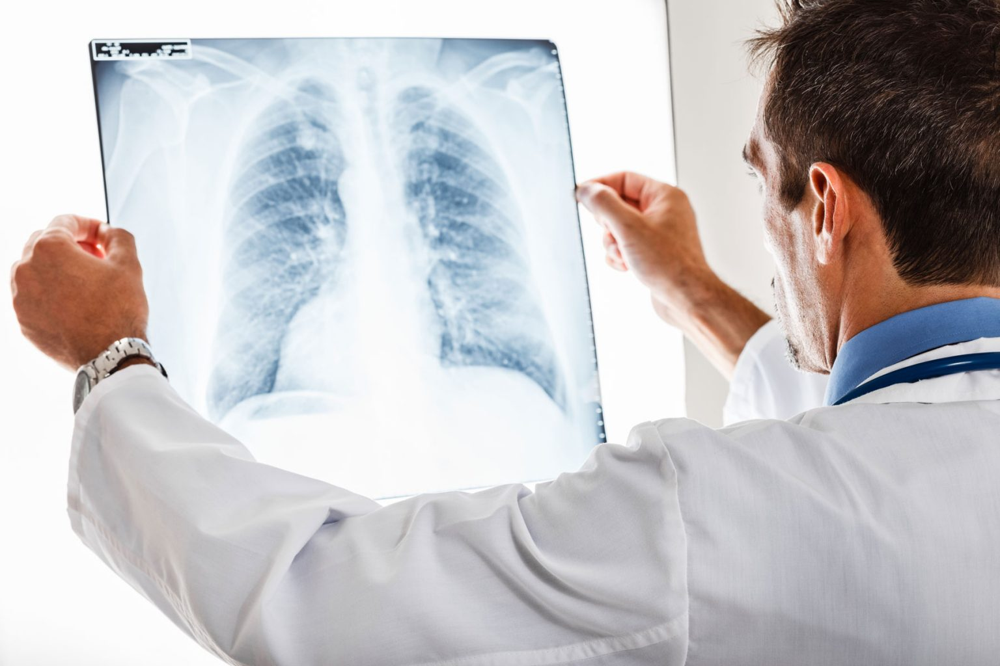
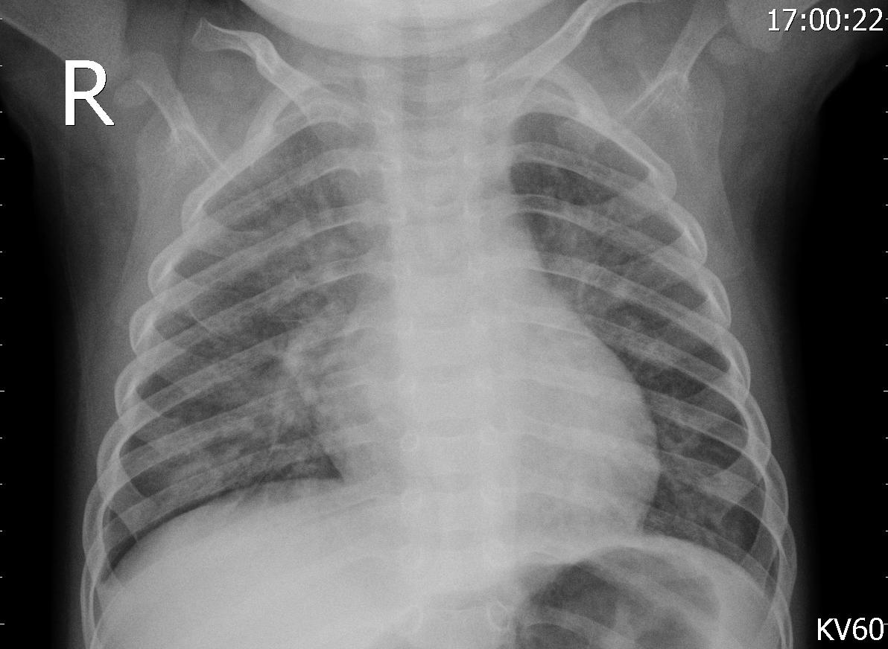
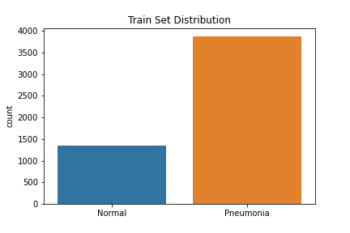
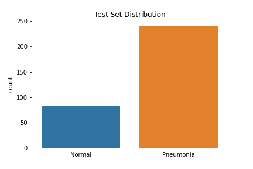
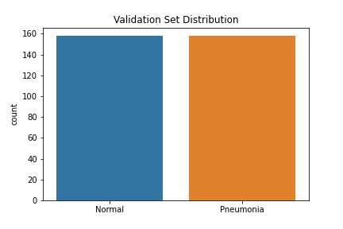
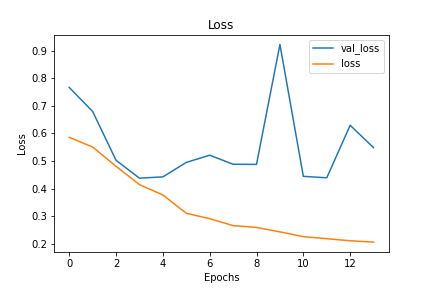
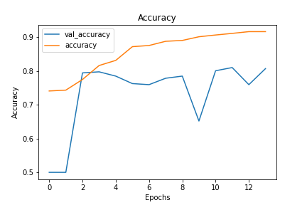
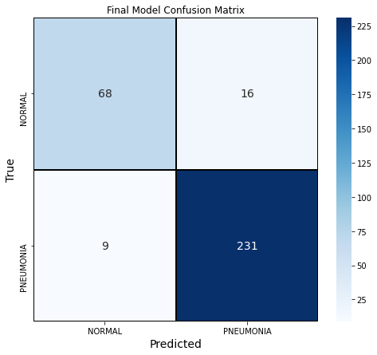

# Pneumonia Image Classification

**Author:** Samantha Knee

## Overview

A shortage of healthcare providers is a major issue facing the U.S. Healthcare industry today. Combine that with a global pandemic, and one could say we have a national crisis on our hands. With the progression of machine learning models, there are parts of the provider's daily workflow we can try to automate to leave more time for direct patient care. In this project, we will use neural networks to classify x-ray images as either having pneumonia or not having pneumonia. With both physician time and hospital capacity constrained, this model can help determine which patients require immediate medical attention and potentially admission to the hospital.

***

## Business Problem

According to the National Institute of Health, pneumonia is an infection of one or both lungs that causes its air sacs to fill with fluid. Many diseases, both bacterial and viral, can cause pneumonia, the most notable cause recently being COVID-19. COVID can make it more difficult for oxygen to reach the lungs, causing shortness of breath or even the need for a ventilator in severe cases. With both a shortage in healthcare providers and hospital beds due to the ongoing pandemic, there is not enough room for all COVID patients to be monitored in the hospital, and there must be a way to determine which of these patients are most at risk.

In this project, we have been hired by a medical clinic specializing in treating COVID-19 patients with moderate cases, in order to try to treat the patient before they require a hospitalization. During times of spikes in cases, the providers at the clinic do not have time to review the chest x-rays of every patient that comes in. Our job is to create a model that classifies each patient as either having or not having pneumonia. The patients tagged as having pneumonia will be further investigated by the providers and in some cases, sent directly to the hospital for treatment. Patients with pneumonia are at high-risk for needing a ventilator and need to be monitored closely.

***

## Data

The data used to create the model comes from Mendeley Data (Kermany, Daniel; Zhang, Kang; Goldbaum, Michael (2018), “Large Dataset of Labeled Optical Coherence Tomography (OCT) and Chest X-Ray Images”, Mendeley Data, V3, doi: 10.17632/rscbjbr9sj.3) and a subset of the original dataset was downloaded from Kaggle. The data provided was split into train, test and validation sets prior to download, although we did move some of the images from our test set into the validation set to improve performance. There were class imbalances in our train and test sets—the train set had 3,875 pneumonia images and 1,341 normal images, while the test set had 240 pneumonia images and 84 normal images. The validation set had a balanced set of 158 images for each class. The images were resized into the correct pixels for proper input into the models.

## Methods

We iterated through 11 different models to reach the final, best-performing version, including both Multi-Level Perceptrons (MLPs) and Convolutional Neural Networks (CNNs). The CNN models performed best as they are known for performing particularly well on image data. CNNs preserve more of the original image data and use filters to recognize small and large patterns in the images, leading to better performance.

For all of our models, we used Stochastic Gradient Descent (SGD) as the optimizer minimizing the cost function and a decaying learning rate. The loss function we were minimizing was binary crossentropy, as this was a binary classification problem (pneumonia vs. no pneumonia). We used Rectified Linear Unit (ReLu) as the activation function in the hidden layers and sigmoid as the activation function for output layers. We ran most of our models for 30 epochs due to time constraints but also implemented early stopping in our better performing models running for 50 epochs. We also used data augmentation in our CNN models to improve performance.

***

## Results

Using accuracy and loss as the main metrics driving our model decisions, we decided on a CNN model with both dropout and early stopping implemented to combat and overfitting. Our final model has test loss of [ ] and test accuracy of [ ] after [ ] epochs. Compared to training loss and accuracy of [ ], this meant this model had limited overfitting.

We also explored the confusion matrix of our final model. This model had a precision score of [ ], recall score of [ ] and F1 score of [ ]. []% of the outcomes were false negatives and []% were false positives.

***

## Conclusions

**Use the final model to decide which patients are at highest risk.** Given the limited capacity at the COVID clinic, the providers should use our model to determine which patients need to be monitored closely. At times during high spikes in cases, the providers can further investigate any patients tagged as having pneumonia. Since COVID can quickly worsen in patients, the model will allow these patients to get the care they need quicker than if the doctors needed to review every single x-ray of every COVID patient.

**Run each image through multiple models.** Our last few CNN models we ran had similar performance but slightly different structure. We would recommend that if the clinic and attached hospital are particularly overwhelmed and reaching capacity, that they run the images through 3 of the CNN models. If a patient is classified as having pneumonia 2 or more times in the models, these patients can be sent directly to the hospital for further treatment. The clinic can continue to monitor the rest of the patients without sending them to the hospital for immediate attention. Using multiple models can help providers further make decisions at times of high constraints.

**Continue to train the model.** At times where cases drop and the providers have more capacity to look at patients and their x-rays, they should add these reviewed x-rays to our dataset. We can then train the model on our data using the new labeled samples, which should continually improve our model's ability to classify. This is especially important for normal, non-pneumonia x-rays, since there is a class imbalance and not as many of these images. Doing this work during slower times will help the model make better decision in times of high cases.

***

## Next Steps

**Transfer Learning.** Transfer learning involves using parts of pretrained networks that were previously trained on large datasets in your own model to achieve better results. With additional time and resources, we would like to explore using transfer learning on these datasets to see if we could obtain better results.

**Using a balance dataset.** As we previously mentioned, there was an imbalance in classes in our train and test set. Next time, we would create our own split of train, test and validation data from the original dataset with a balanced number of pneumonia and non-pneumonia samples, to see if that would improve our results.

**Train each model for longer.** Due to time constraints, we were not able to train all of our models on 100+ epochs. We likely could have reached convergence on some of our models if we were able to train for longer.

***

## For More Information

Please review the detailed analysis in this [Jupyter Notebook](../Pneumonia_Classification_Notebook.ipynb) and this [presentation](../pneumonia_classification_presentation.pdf).

For any additional questions, please contact Samantha Knee at samanthaknee24@gmail.com

## Repository Structure
***
├── README.md                                          <- The top-level README for reviewers of this project
├── Pneumonia_Classification_Notebook.ipynb            <- Narrative documentation of data cleaning and modeling in Jupyter notebook
├── pneumonia_classification_presentation.pdf          <- PDF version of project presentation
├── data                                               <- Both sourced externally and generated from code
└── images                                             <- Both sourced externally and generated from code